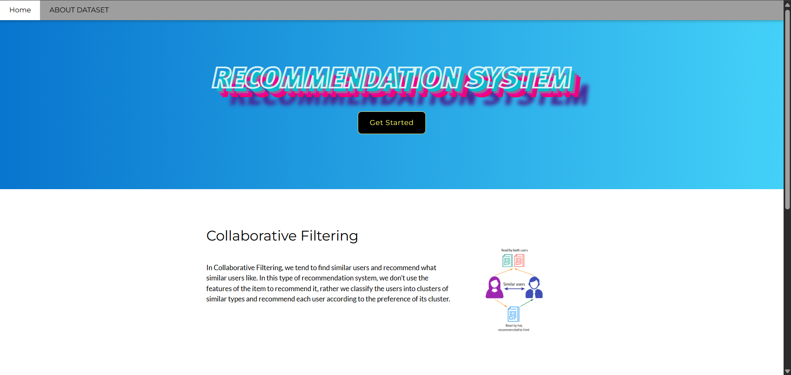
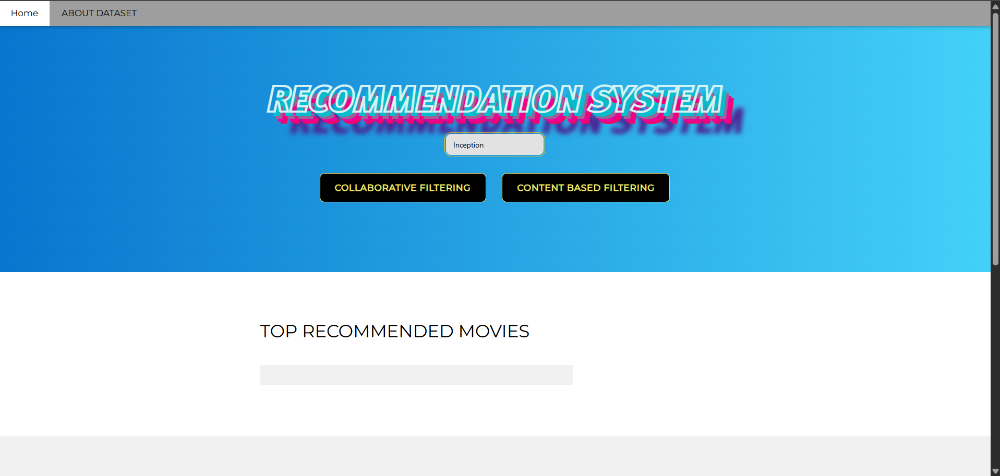
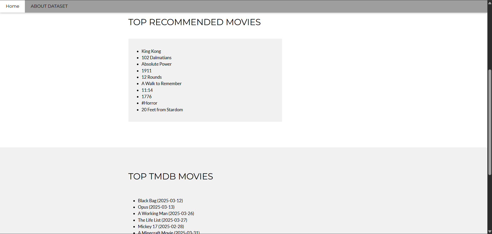
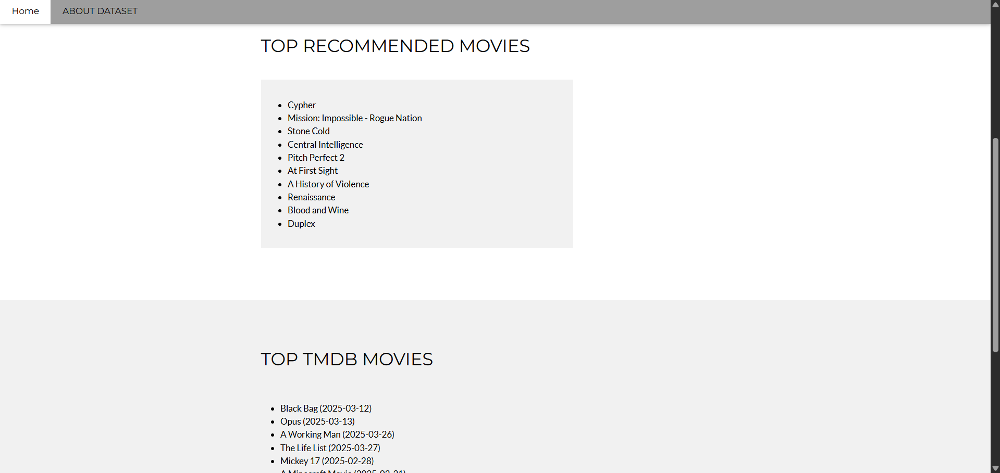
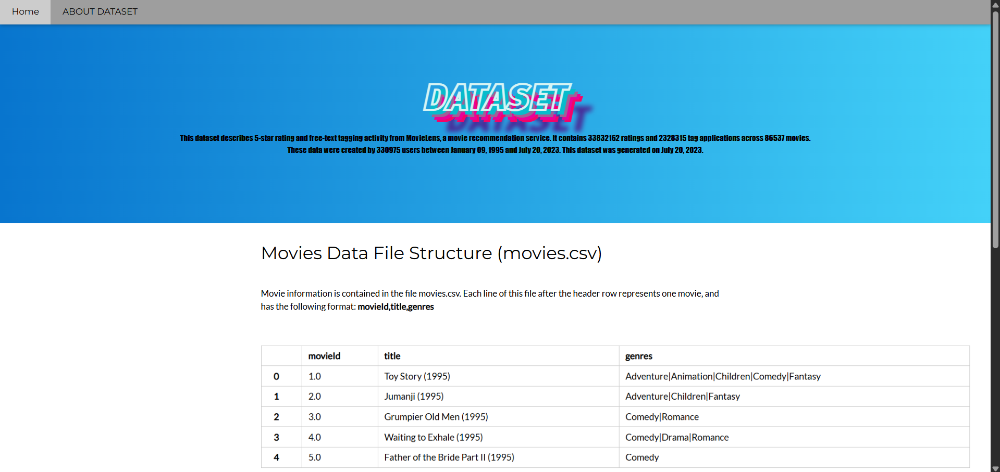
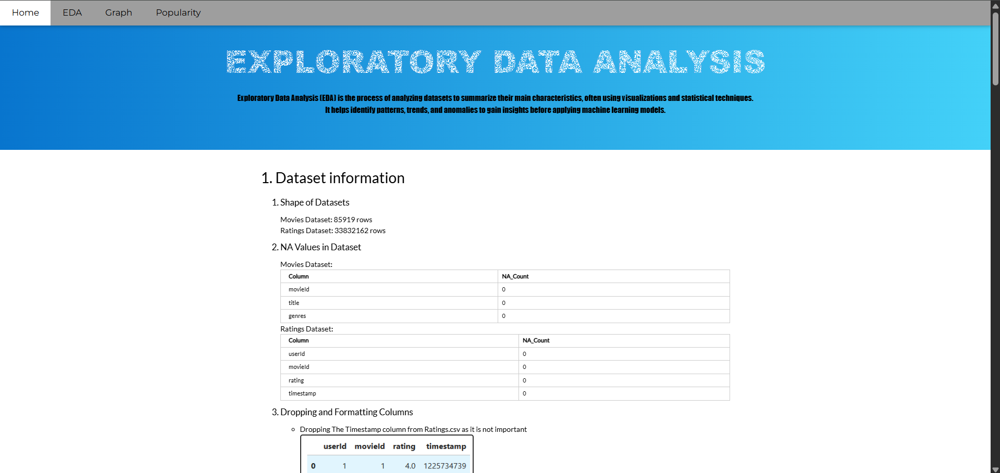
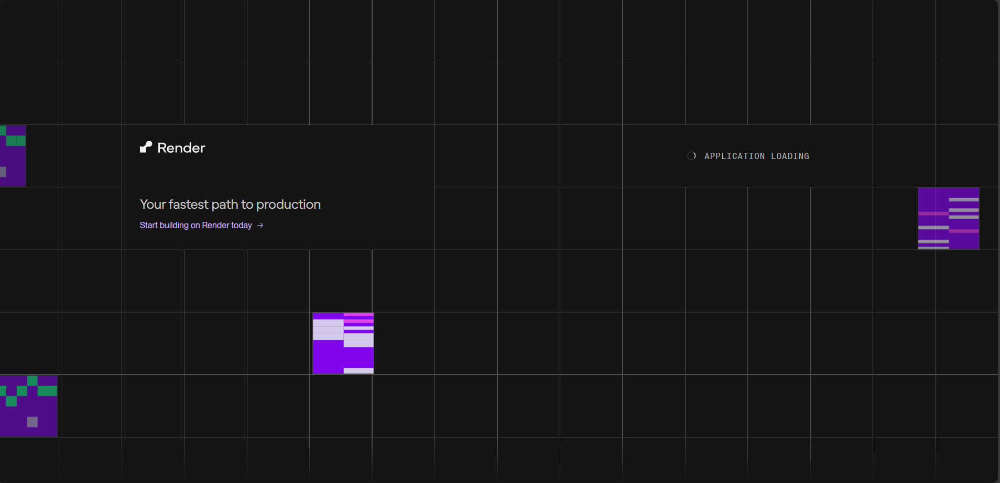

# 🎬 Movie Recommender

This project is a web-based application built using **FastAPI** that recommends similar movies based on user input. It leverages natural language processing and cosine similarity to suggest content-based or collaborative filtering movie recommendations. A clean, interactive web interface allows users to explore similar movies with ease.

## 🌟 Features

- **Search Movies**: Enter a movie name and receive a list of similar titles.
- **Content-Based Filtering**: Uses TF-IDF vectorization and cosine similarity.
- **Collaborative Filtering**: Uses sparse matrix and cosine similarity.
- **TMDB Integration**: Optionally integrates with The Movie Database (TMDb) API to fetch top movies of the day.
- **FastAPI Backend**: High-performance backend built with FastAPI.
- **AWS Integration**: Used AWS S3 storage for storing recommendation models on cloud and retreiving it using AWS IAM user.
- **Simple Frontend**: HTML templates rendered via Jinja2.

## 🗂 Project Structure

```
movie-recommender/
├── main.py                # FastAPI entry point
├── index.py               # UI routes and search handling
├── recommendation.py      # Recommendation logic
├── model.py               # Loads vectorizer and similarity matrix
├── reco_pkl.py            # Handles loading pickled models/data from AWS console.
├── requirements.txt       # Project dependencies
├── .env                   # Environment variables (e.g., TMDB API key)
├── templates/             # HTML templates
├── static/                # Static assets (CSS, images)
└── .git/                  # Git version control files
```

## 🛠 Installation

### 1. Clone the Repository

```bash
git clone https://github.com/yourusername/movie-recommender.git
cd movie-recommender/python - Copy
```

### 2. Create a Virtual Environment

```bash
python -m venv venv
```

### 3. Activate the Virtual Environment

- On Windows:
  ```bash
  venv\Scripts\activate
  ```
- On macOS/Linux:
  ```bash
  source venv/bin/activate
  ```

### 4. Install Dependencies

```bash
pip install -r requirements.txt
```

### 5. Set Environment Variables

Create a `.env` file in the project root:

```
TMDB_API_KEY=your_tmdb_api_key_here
```

You can get a free API key from [The Movie Database](https://www.themoviedb.org/documentation/api).

### 6. Run the Application

```bash
python index.py
```

Visit: [http://127.0.0.1:8000](http://127.0.0.1:8000)

## 🚀 Usage

1. Launch the app and open it in your browser.
2. Enter a movie name into the search field.
3. Select which type of recommendation you want ( Content Based or Collaborative filtering)
4. View recommended similar movies.
5. (Optional) See top movies of the day fetched from TMDB.

## 🔍 Dependencies

- FastAPI
- Uvicorn
- Scikit-learn
- Pandas
- Jinja2
- python-dotenv

All required packages are listed in `requirements.txt`.

## 📷 Demo







## 📄 Deployement
-This app is deployed using render service.
Visit : https://movie-recc-30m.onrender.com

-After visiting the URL , you may be encountered with the following screen. Please wait for a while as render restarts the service


-After selecting a filter type and entering a movie, the app may take a little longer to load the first time as it downloads the recommendation model from AWS cloud storage.
